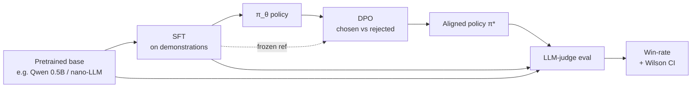

<div align="center">


<a href="https://github.com/Umarfarook1/DPO-on-my-LLM">
  
</a>

<br/>

<p>
  
  
  
  
  
</p>

<sub><i>Pretraining gives you knowledge. Post-training gives you a useful assistant. This repo does the second half · clearly, with a real eval.</i></sub>

</div>

---

## Why this repo exists

Pretrained next-token predictors are not assistants. The transformation from "raw LM" to "thing that follows instructions" is a stack: **SFT** (supervised fine-tune on demonstrations) → **DPO** (direct preference optimization on chosen/rejected pairs) → **eval** (LLM-judge with win-rates and confidence intervals). This repo runs that stack on a small open model and reports honest numbers.

Bonus: pairs naturally with [`Nano-LLM-from-scratch`](https://github.com/Umarfarook1/Nano-LLM-from-scratch) · pretrain there, post-train here.

> **Status:** design complete, implementation starting · no code in the repo yet. First milestone: a measurable win-rate over the SFT-only baseline.

## Pipeline



## What gets measured

DPO papers love to report "preference accuracy" on the training distribution. That's not enough. This repo measures:

| Stage | What | How | Why it matters |
|---|---|---|---|
| Reward modelling sanity | Pref accuracy on held-out chosen/rejected | classification | catches data leakage |
| Generation quality | Win-rate vs. SFT baseline | LLM-judge with position swap | what users actually feel |
| Format / refusal | Adherence to system prompt | rule-based suite | post-training often regresses these |
| Capability | MT-Bench-style multi-turn | LLM-judge graded 1–10 | guards against alignment-tax |
| Length bias | Length-controlled win-rate | length-matched pairs | DPO loves to ramble · measure it |

## Stack

| Component | Choice | Why |
|---|---|---|
| Base model | small open weight (Qwen 0.5B / TinyLlama / nano-LLM) | cheap iteration |
| SFT data | UltraChat-style instruction mix | broad coverage |
| Pref data | UltraFeedback subset + custom slice | DPO on real pairs |
| Trainer | HF TRL `SFTTrainer` + `DPOTrainer` | standard, peer-reviewed |
| PEFT | LoRA + 4-bit quant | runs on a single GPU |
| Judge | larger open model + position-swap | reduces single-judge bias |
| Eval harness | local; logs JSONL with prompts, completions, judge votes | reproducible |

## Quickstart <sub><i>(planned · code landing incrementally)</i></sub>

```bash
# 1) SFT on demonstrations (LoRA, single GPU)
uv run scripts/sft.py --config configs/sft.yaml

# 2) DPO on preference pairs
uv run scripts/dpo.py --config configs/dpo.yaml --base out/sft

# 3) Generate completions for the eval prompt set
uv run scripts/generate.py --models base,sft,dpo --prompts data/eval_prompts.jsonl

# 4) Judge with position-swap, report win-rate + Wilson CI
uv run scripts/judge.py --judge Qwen2.5-7B-Instruct --pairs out/eval/pairs.jsonl

# 5) Render the report
uv run scripts/report.py --out reports/v1.md
```

## Headline numbers <sub><i>(populated as runs complete)</i></sub>

| Comparison | Win-rate (95% CI) | Length-controlled WR | Notes |
|---|---|---|---|
| SFT vs Base | TBD | TBD | sanity check |
| DPO vs SFT | TBD | TBD | the real question |
| DPO vs Base | TBD | TBD | end-to-end uplift |

## Roadmap

- [ ] Data pipeline: SFT mix + preference pairs (chosen/rejected, formatted)
- [ ] SFT trainer with LoRA + 4-bit quant + chat template
- [ ] DPO trainer with reference model
- [ ] Generation harness (deterministic + sampling configs)
- [ ] LLM-judge harness with position-swap and Wilson CIs
- [ ] Length-controlled win-rate
- [ ] Capability eval (MT-Bench-style subset)
- [ ] Ablations: β, learning rate, KL coefficient, pref-data size
- [ ] Push aligned weights + tokenizer + eval card to Hugging Face Hub
- [ ] Companion blog post: *"DPO without the magic · what actually moved the win-rate"*

## Inspiration & required reading

- [Rafailov et al. · DPO paper (2023)](https://arxiv.org/abs/2305.18290)
- [Nathan Lambert · RLHF Book (arXiv 2504.12501)](https://arxiv.org/abs/2504.12501) and [interconnects.ai](https://www.interconnects.ai/)
- [huggingface/trl](https://github.com/huggingface/trl) · reference implementation
- [OpenRLHF/OpenRLHF](https://github.com/OpenRLHF/OpenRLHF) · multi-method post-training stack
- [allenai/open-instruct](https://github.com/allenai/open-instruct) · academia-quality post-training recipes
- [tatsu-lab/alpaca_eval](https://github.com/tatsu-lab/alpaca_eval) · judging methodology

---

<div align="center">

</div>
